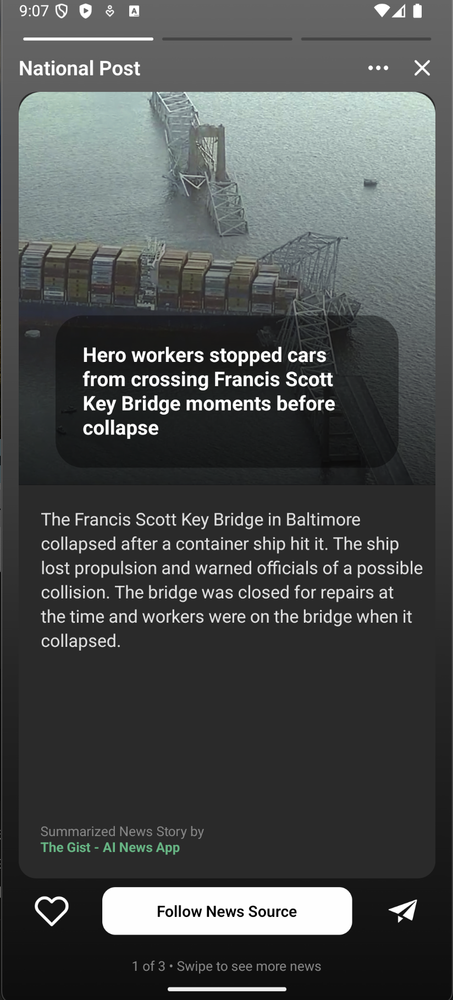
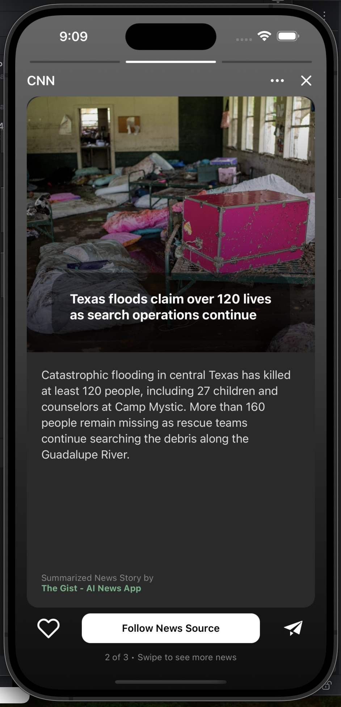

# Gist Hybrid App

A news card app that runs on both web and mobile using shared components.

## How I Built This

I wanted to understand how monorepo hybrid apps work, so I built this news card interface.

**The structure is simple:**
- `apps/native/` - Expo app for mobile
- `apps/web/` - Next.js app for web
- `packages/ui/` - Shared components

Since I'm only building one page, not a full app, I put most of the code in `packages/ui/` so both platforms can use the same components.

**My process:**
1. Analyzed the design - full screen image, gradient overlay, card layout
2. Broke it down into components - background, header, main card, buttons
3. Built the layout structure first
4. Added the visual styling (gradients, glassmorphism effect)
5. Made buttons functional with local data (no backend needed)
6. Tests on different simulators web/ios/android to modify CSS styles.

The tricky part was making React Native components work on web, but `react-native-web` handles most of it automatically.

## How to Run

**First time setup:**
```bash
npm install
```

**For web:**
```bash
npm run web
```
Opens at `http://localhost:3000`

**For mobile:**
```bash
npm run native
```
Then press `i` to open the iOS simulator. (iPhone 16 Plus)
Then press `a` to for Android simulator. (Medium Phone API 35, Android 15.0 VanillalceCream|arm64)

## What I Learned

The hybrid approach works well when you want to share UI logic between platforms. Instead of building separate apps, you write components once and they run everywhere. Perfect for simple interfaces like this news card.

The key insight: put shared code in `packages/`, platform-specific stuff in `apps/`.

## Screenshots


